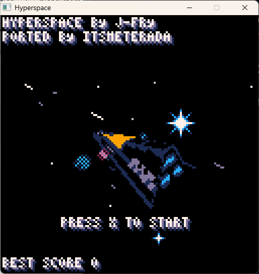

# Hyperspace - SDL2 Port

A native SDL2 port of the PICO-8 game **Hyperspace** by [J-Fry](https://www.lexaloffle.com/bbs/?uid=45955).



## About

Hyperspace is a 3D space shooter originally created for PICO-8. This project ports the game to native C using SDL2, allowing it to run without the PICO-8 runtime.

## Requirements

- SDL2 library
- C99 compatible compiler (GCC, Clang, MSVC)

## Building

### Using Make

```bash
make
```

### Using CMake

```bash
mkdir build
cd build
cmake ..
make
```

### Platform-specific notes

**Windows (MSYS2/MinGW):**
```bash
pacman -S mingw-w64-x86_64-SDL2
make
```

**macOS (Homebrew):**
```bash
brew install sdl2
make
```

**Linux (Debian/Ubuntu):**
```bash
sudo apt install libsdl2-dev
make
```

## Running

```bash
./hyperspace      # Linux/macOS
hyperspace.exe    # Windows
```

## Controls

- **Arrow Keys**: Move ship (roll/pitch)
- **Z / C**: Fire lasers
- **X**: Boost

## Technical Details

### Architecture

This port reimplements the PICO-8 API in C, providing a compatibility layer that allows the game logic to run natively.

### Graphics

- **Resolution**: 128x128 pixels (PICO-8 native), scaled 4x for display (512x512)
- **Color Palette**: 16-color PICO-8 palette
- **Font**: 3x5 pixel font (PICO-8 compatible)
- **Rendering**: Software rasterization to a virtual framebuffer

### 3D Engine

- **Projection**: Perspective projection with configurable camera depth
- **Transformations**: 3x4 matrix operations (rotation, translation, multiplication)
- **Triangle Rasterization**: Scanline-based software rasterizer with Z-sorting (painter's algorithm)
- **Lighting**: Directional lighting with per-triangle shading
- **Mesh Format**: Custom binary format decoded from PICO-8 map memory

### PICO-8 API Implementation

The following PICO-8 functions are implemented:

| Category | Functions |
|----------|-----------|
| Graphics | `cls`, `pset`, `pget`, `sget`, `line`, `rect`, `rectfill`, `circ`, `circfill`, `spr`, `pal`, `clip`, `color` |
| Text | `print` (3x5 font) |
| Math | `rnd`, `flr`, `mid`, `sgn`, `sin`, `cos`, `atan2`, `sqrt`, `abs` |
| Input | `btn`, `btnp` |
| Memory | `peek` (map memory access) |
| Persistence | `cartdata`, `dget`, `dset` |

### Game Objects

| Object | Max Count | Description |
|--------|-----------|-------------|
| Lasers | 100 | Player projectiles |
| Enemy Lasers | 100 | Enemy projectiles |
| Trails | 64 | Engine exhaust trails |
| Backgrounds | 64 | Starfield particles |
| Enemies | 50 | Enemy ships and asteroids |

### Enemy Types

| Type | Scale | Health | Score | Radius |
|------|-------|--------|-------|--------|
| 0 | 1.0x | 1 | 1 | 3.25 |
| 1 | 2.5x | 3 | 10 | 6.0 |
| 2 | 3.0x | 10 | 10 | 8.0 |
| 3 (Boss) | 5.0x | 80 | 100 | 16.0 |

### Data Structures

```c
typedef struct { float x, y, z; } Vec3;
typedef struct { float m[12]; } Mat34;  // 3x4 transformation matrix
typedef struct { Vec3 pos; int tri[3]; float uv[3][2]; Vec3 normal; float z; } Triangle;
typedef struct { Vec3* vertices; Vec3* projected; Triangle* triangles; int num_vertices; int num_triangles; } Mesh;
```

### Limitations

- **No Audio**: Sound effects (`sfx`) are stubbed out
- **No Music**: Music playback is not implemented
- **Fixed Scale**: Display scale is hardcoded to 4x

## Credits

- **Original Game**: [J-Fry](https://www.lexaloffle.com/bbs/?uid=45955) (PICO-8)
- **SDL2 Port**: itsmeterada

## License

This is a fan port of the original PICO-8 game. Please refer to the original author for licensing information.
